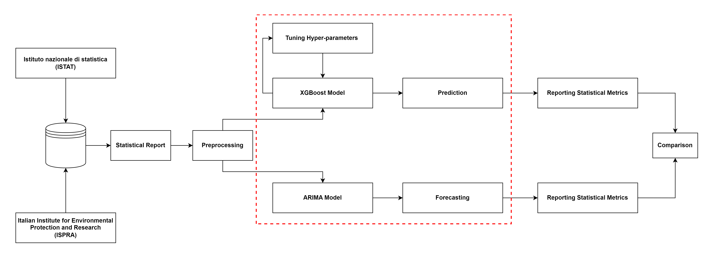

# README

This repository contains the source code for the study described in the paper "Exploring the Relationship between Air Pollution and CNS Disease Mortality in Italy: A Forecasting Study with ARIMA and XGBoost" submitted to the 2023 World Congress in Computer Science, Computer Engineering, and Applied Computing.

There is a correlation between air pollution and CNS disease, according to the research. Air pollution has been linked to an increased risk of developing neurodegenerative diseases like Alzheimer's and Parkinson's. Airborne toxins can penetrate the brain and induce inflammation, resulting in damage and cognitive decline. Air pollution is a significant environmental health issue that can harm people's health in a variety of ways, such as by increasing their risk of heart and respiratory diseases. From 2010 to 2020, we looked at data from 107 Italian cities about air pollution and deaths caused by Central Nervous System (CNS) diseases like Alzheimer's and Parkinson's. Then, we compared the performance of the Autoregressive Integrated Moving Average (ARIMA) model and Extreme Gradient Boosting (XGBoost) with grid search in terms of accuracy and training time for forecasting the number of deaths caused by CNS diseases in the forthcoming year. According to our research, both models could accurately predict how much PM2.5 and PM10 were in the air and how many people would die from CNS diseases. Also, ARIMA is more accurate than XGBoost, but it takes longer to train. Both ARIMA and XGBoost are good at predicting CNS death based on air pollution, which is what our result shows. Therefore, the choice of model depends on the user's particular requirements, with ARIMA being preferred for applications where accuracy is crucial and XGBoost being preferred when training time is an issue. Overall, our findings indicate that air pollution is a significant risk factor for CNS diseases, and accurate prediction models can aid in mitigating its effects.

### Workflow Diagram

## Installation

1. Clone the repository:

git clone https://github.com/Dechosenone/CNS_prediction.git

2. Install the required packages:

pip install -r requirements.txt

## Data

The data used in the experiments is available at [ISTAT](https://www.istat.it/) and [ISPRA](https://www.isprambiente.gov.it/en/istitute/index). 

<!-- ## Citation

If you use this code for your research, please cite our paper: -->

## Authors

Mostafa Karami
Electronics and Telecommunications
Polytechnic University of Turin
Turin, Italy
mostafa.karami@studenti.polito.it
-----------
Sahand Hamzehei
Electronics and Telecommunications
Polytechnic University of Turin
Turin, Italy
sahand.hamzehei@studenti.polito.it
------------
Farzaneh Rastegari
Computer Science and Engineering Department
University of Connecticut
Storrs, United States
farzaneh.rastegari@uconn.edu
-----------
Omid Akbarzadeh
Electronics and Telecommunications
Polytechnic University of Turin
Turin, Italy
omid.akbarzadeh@studenti.polito.it